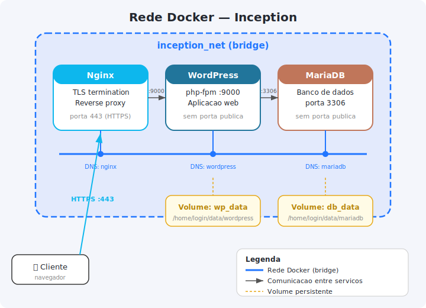

# TEORIA_DOCKER_INCEPTION.md

## 1) O que e Docker

Docker e uma plataforma de containerizacao.
Ele empacota aplicacao + dependencias em imagens e executa em containers isolados.

No Inception, Docker e usado para separar servicos:
- Nginx
- WordPress (php-fpm)
- MariaDB

## 2) Conceitos fundamentais

## 2.1 Imagem
Imagem e um template imutavel para criar containers.
Ela e gerada por um `Dockerfile`.

## 2.2 Container
Container e uma instancia em execucao de uma imagem.
Ele compartilha kernel do host, mas tem isolamento de processo/rede/fs.

## 2.3 Dockerfile
Arquivo declarativo que define como construir imagem.
Exemplos de instrucoes:
- `FROM`
- `RUN`
- `COPY`
- `CMD` / `ENTRYPOINT`

## 2.4 Volume
Volume e armazenamento persistente fora do ciclo de vida do container.
No Inception, necessario para:
- banco do MariaDB
- arquivos do WordPress

## 2.5 Network
Rede Docker permite comunicacao entre containers por nome de servico.
Exemplo: WordPress conecta em `mariadb`.

## 3) Docker vs VM

Docker:
- leve
- inicia rapido
- compartilha kernel
- ideal para microservicos

VM:
- virtualiza sistema operacional completo
- mais pesada
- mais isolamento de kernel

No Inception, a VM hospeda Docker; Docker hospeda os servicos.

## 4) Ciclo de vida no Inception

1. Escrever `Dockerfile` por servico.
2. Definir `docker-compose.yml`.
3. Rodar build.
4. Subir containers.
5. Verificar logs/saude.
6. Validar persistencia e rede.

## 5) Docker Compose (teoria)

Compose orquestra multi-container via YAML.
No Inception, ele define:
- services
- networks
- volumes
- secrets

Beneficios:
- reproducibilidade
- um comando para subir tudo
- configuracao versionada

## 6) Principios importantes para o projeto

## 6.1 Um servico por container
Cada container deve ter responsabilidade unica.
Exemplo:
- Nginx so proxy/TLS
- WordPress so php-fpm/app
- MariaDB so banco

## 6.2 Processo principal em foreground
Container vive enquanto processo PID 1 vive.
Evitar hacks como:
- `tail -f`
- `sleep infinity`
- `while true`

## 6.3 Sem `latest`
Tag `latest` quebra previsibilidade.
Use versao fixa/estavel.

## 6.4 Sem credenciais no Dockerfile
Credenciais devem ficar em:
- `.env` (nao sensivel)
- `secrets` (sensivel)

## 7) Persistencia no Inception

Requisito do enunciado:
- dados em `/home/<login>/data`

Por que importante:
- container pode ser recriado
- dados devem sobreviver a restart/rebuild

Sem volume correto, banco e site podem ser perdidos.

## 8) Rede no Inception

Regras:
- usar rede Docker dedicada
- sem `network_mode: host`
- sem `links`

Razao:
- isolamento
- descoberta de servico por DNS interno
- padrao moderno do Compose

## 9) Seguranca basica

- expor somente o necessario (Nginx 443)
- servicos internos sem porta publica
- usar TLS 1.2/1.3 no Nginx
- usar usuario de aplicacao no banco (nao root)
- minimizar superficie de ataque

## 10) Build, cache e camadas

Docker build cria camadas.
Vantagem:
- reutiliza cache para acelerar build.

Cuidado:
- mudanca em camada inicial invalida camadas seguintes.
- cache pode mascarar erro antigo; as vezes usar `--no-cache`.

## 11) Comandos conceituais mais usados

- `docker build`: constroi imagem.
- `docker run`: sobe container isolado.
- `docker compose up -d --build`: sobe stack completa.
- `docker ps`: lista containers ativos.
- `docker logs <container>`: logs.
- `docker exec -it <container> bash`: shell no container.
- `docker volume ls`: lista volumes.
- `docker network ls`: lista redes.

## 12) Erros teoricos comuns

- Container sobe e cai:
  processo principal nao ficou em foreground.

- App nao acha banco:
  nome de host/rede errados.

- Dados somem:
  volume nao configurado corretamente.

- Reprova mesmo funcionando:
  violacao de regra (latest, host network, portas extras, segredos expostos).

## 13) Perguntas comuns de defesa

- Por que Docker nesse projeto?
  Reprodutibilidade, isolamento e deploy consistente por servico.

- Diferenca principal entre imagem e container?
  Imagem e template; container e instancia executando.

- Por que volume e obrigatorio?
  Para persistir dados fora do ciclo de vida do container.

- Por que Compose?
  Para orquestrar varios servicos com uma configuracao unica.

- Por que so Nginx expoe porta?
  Para centralizar entrada e reduzir exposicao de servicos internos.

## 14) Checklist teorico minimo

1. Saber explicar imagem, container, Dockerfile, volume e network.
2. Saber justificar um servico por container.
3. Saber explicar persistencia em `/home/<login>/data`.
4. Saber explicar Compose como orquestrador.
5. Saber explicar seguranca: entrypoint unico, TLS, secrets.

Com essa base, voce consegue defender a parte Docker do Inception com clareza.
